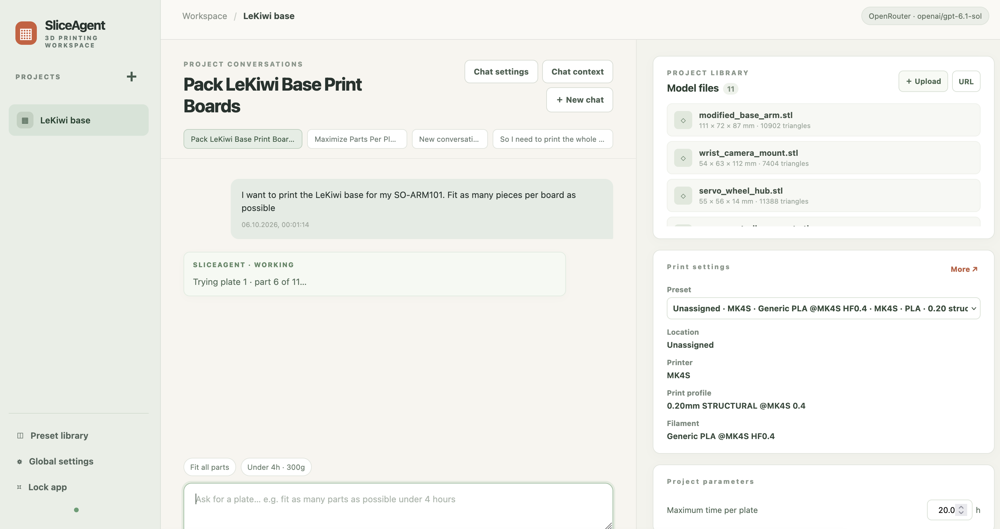
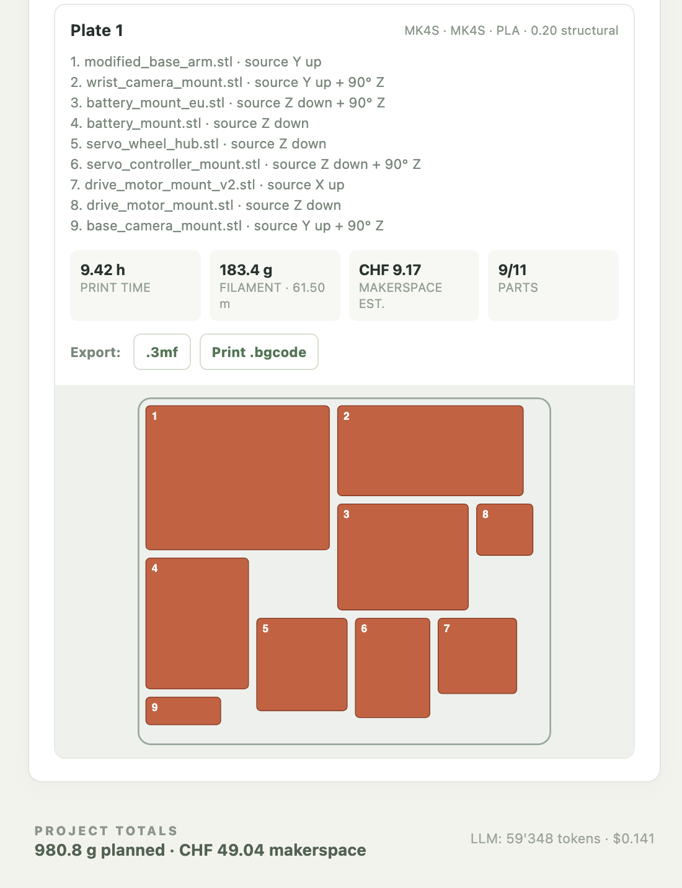

# SliceAgent (first review build)

Work in progress.

## Human-written intro
Can frontier AI models adequately place items on a 3d printer build plate ? This would be useful to me, and this project is a trial to find out. The aim is a slicing assistant, which takes in STL model files (or which retrieves the appropriate files based on the conversation), and place items on a build plate(s) in a way that ensures quality, while respecting constraints of time and filament. For instance, a request I'd like to be able to make is the following:
> I have a [SO-ARM101](https://github.com/TheRobotStudio/SO-ARM100), and I'd like to add a [LeKiwi](https://github.com/SIGRobotics-UIUC/LeKiwi/) base to it. I have a Prusa MK4S for 5 hours right now and 300g of PLA. I want to print as much as possible.

Based on this request, the agent should:
- retrieve the relevant STL files <= AI task
- positions them on the build plate in a sliceable way, while maintaining good practices (especially orientation) <= AI task
- uses MK4S presets to call PrusaSlicer to slice the plate.
- based on the time and filament estimation, the agent can then add/displace/remove elements from the plate if need be, to respect the time and filament constraints.
- the user can export the build plate as a project .3mf file to inspect it in PrusaSlicer (or other), or directly export the G-code (`.bgcode`) to print the plate

In its first version, the tool takes the form of a local-first web app in Rust (following the idea that the Rust compiler's verbosity is a good feedback mechanism for a coding agent, like Codex which is being used here). The server runs on the computer or VPS that has PrusaSlicer; a phone only needs a browser connection to that server.

Benchmarking: Orcaslicer has an [auto-orient functionality](https://github.com/orcaslicer/orcaslicer/wiki/prepare_auto_orient) that "automatically finds the optimal orientation for 3D models to minimize support requirements and improve print quality." This functionality relies on a printability score, which could be used for SliceAgent.

## Interface
### Input


### Output


## Machine-written technical guide to usage
## Run locally

```sh
cargo run
```

Open `http://127.0.0.1:8765`. On first start, SliceAgent creates a random app access token in `data/access_token`. Read it on the server with `cat data/access_token` and enter it in the unlock screen. This token is separate from your LLM API key. The browser receives an HttpOnly, SameSite cookie after login; it does not save the access token in browser storage. The cookie lasts seven days or until you use **Lock app**. Restarting the server also ends browser sessions. Keep the token file private and do not paste the token into chat, screenshots, or logs.

The server listens only on loopback, including on a VPS. Use an HTTPS proxy for phone or remote access; see [Remote access](#remote-access). Direct HTTP access to port 8765 from another machine is intentionally disabled.

| Variable | Purpose |
| --- | --- |
| `SLICER_AGENT_BIND` | Listen address; default `127.0.0.1:8765` |
| `SLICER_AGENT_DATA` | SQLite database and model/job storage; default `data/` |
| `PRUSA_SLICER` | PrusaSlicer executable path if auto detection fails |
| `OPENAI_API_KEY` | Optional server environment alternative to entering a key in the GUI |
| `OPENAI_MODEL` | Optional model identifier for environment setup; default `gpt-6-astra` |
| `ANTHROPIC_API_KEY` | Optional Claude API key in the server environment instead of the GUI |
| `ANTHROPIC_MODEL` | Optional Claude model ID; default `claude-sonnet-4-6` |
| `OPENROUTER_API_KEY` | Optional OpenRouter API key in the server environment instead of the GUI |
| `OPENROUTER_MODEL` | Optional OpenRouter model ID; default `anthropic/claude-sonnet-4.6` |
| `OPENAI_INPUT_USD_PER_M` | Optional input-token price in USD per million tokens |
| `OPENAI_CACHED_INPUT_USD_PER_M` | Optional cached-input price in USD per million tokens |
| `OPENAI_OUTPUT_USD_PER_M` | Optional output-token price in USD per million tokens |
| `ANTHROPIC_INPUT_USD_PER_M` | Optional Claude uncached-input price in USD per million tokens |
| `ANTHROPIC_CACHED_INPUT_USD_PER_M` | Optional Claude cache-read price in USD per million tokens |
| `ANTHROPIC_OUTPUT_USD_PER_M` | Optional Claude output price in USD per million tokens |
| `ANTHROPIC_CACHE_WRITE_USD_PER_M` | Optional Claude cache-write price if cache writes are used |
| `SLICER_AGENT_TOKEN` | Optional custom app access token (at least 32 characters); otherwise SliceAgent creates `data/access_token` |
| `SLICER_AGENT_PUBLIC_URL` | HTTPS origin used by the remote proxy, such as `https://print.example.com`; enables a Secure browser cookie |

To connect an LLM from the GUI, click **Connect LLM API** in the top bar or **Global settings** in the sidebar. Select **OpenRouter**, **OpenAI direct**, or **Anthropic direct**, enter a model ID and the corresponding API key, then click **Save connection** and **Test connection**. For Claude through OpenRouter, use model ID `anthropic/claude-sonnet-4.6` and an OpenRouter key. Direct Anthropic uses its own key and model ID `claude-sonnet-4-6`. The test sends a short message through the same provider path as a real request; it may incur a small API charge. The selected provider, model, and key are stored in `data/llm_config.json` with owner-only file permissions on macOS/Linux; the API never returns the key to the browser. The file is ignored by Git. Selecting a different provider requires its own key: SliceAgent never sends a saved key to another provider. On a VPS, enter a key only after HTTPS remote access is working.

## Remote access

**Recommended initially: Tailscale Serve.** Install Tailscale on the VPS and each device that should use SliceAgent, including your iPhone. Join them to the same tailnet, then start SliceAgent on the VPS with `SLICER_AGENT_PUBLIC_URL` set to its Tailscale HTTPS URL. In another terminal on the VPS run:

```sh
tailscale serve --bg 8765
tailscale serve status
```

Serve prints a URL such as `https://your-vps.your-tailnet.ts.net`. Set `SLICER_AGENT_PUBLIC_URL` to that **exact origin** and restart SliceAgent. Do not use `tailscale funnel`: Funnel publishes to the public internet. Keep `SLICER_AGENT_BIND` at its default `127.0.0.1:8765`. Once the public URL is configured, use its HTTPS URL for browser login, including from the VPS; the Secure cookie is not sent over local HTTP. Tailscale may prompt you once to enable HTTPS certificates. [Tailscale Serve documentation](https://tailscale.com/docs/features/tailscale-serve)

**Later option: domain + Caddy.** Point a domain at the VPS, install Caddy, and adapt [`deploy/Caddyfile.example`](deploy/Caddyfile.example). Allow incoming TCP 80/443 to Caddy, but keep port 8765 private. Set `SLICER_AGENT_PUBLIC_URL=https://your-domain` when starting SliceAgent. Caddy obtains and renews the HTTPS certificate and redirects HTTP to HTTPS. The same app login still applies. [Caddy HTTPS documentation](https://caddyserver.com/docs/caddyfile/options)

The access token protects all project, job, and download API routes. The UI is static and can be fetched before login; project data cannot. To rotate a generated token, stop SliceAgent, replace `data/access_token` with a new random token of at least 32 characters at mode 600, and restart. The token can also be used by scripts as an `Authorization: Bearer` header. Avoid including it in command lines saved to shell history. There is no account recovery or multi-user role system yet; back up `data/` securely.

Alternatively, set `OPENROUTER_API_KEY`, `OPENAI_API_KEY`, or `ANTHROPIC_API_KEY` and optionally the matching model variable in the server environment before starting SliceAgent. GUI settings take precedence over environment values for the selected provider. The top bar says **Connect LLM API · basic mode** until a key is available. Basic mode can inventory files and parse simple, explicit slicing commands and limits. It is not a general chat agent. OpenRouter and successful direct Anthropic inference still need a live key test. Token counts are stored per project when an API call succeeds. OpenRouter reports the billed USD cost in its response; direct providers need configured input, cached-input, and output prices to show a USD estimate, and direct Claude cache writes additionally require a cache-write price. The LLM summarizes a chat title from its first request; basic mode leaves the title as “New conversation.”

## Presets and workflow

Two editable preset entries are seeded for MK4S and CORE One. Their named Prusa profiles must actually be installed on the server, or a combined PrusaSlicer `.ini` must be uploaded to the preset. Presets have a location, printer, and filament profile. The editor exposes common print controls such as layer height, infill, supports, perimeters, and brim; blank controls inherit the source profile. Filament price in CHF/kg is saved separately for each location and filament profile. A makerspace print charge in CHF/g or CHF/m is saved for each project, and the app reports both estimates separately.

Preset and email precedence is global default → project override → chat override. A printer or limit written in the current request applies to that run. The global default preset and email are in the sidebar. Each project has an inline preset and maximum hours per plate; each chat can override its preset, time limit, gram limit, and email. Projects default to a strict four-hour limit per plate. Project and chat context can include text and one Markdown/text file each. With an LLM API configured, that context can guide the seven supported print controls; the current request takes precedence.

Upload STL files, or import a public GitHub repository of STLs. Ask for a parts review first if the print list is uncertain. An explicit request such as “slice these files under 4 hours and 300 g per plate” starts a background job; the chat shows its progress. The Output panel shows each plate as soon as its exports finish, including its preview, estimates, and 3MF/BGCODE downloads. It keeps the latest available plates visible while another request is planned, running, or failed; before the first slicing attempt, the panel remains empty. A partial result names every part it could not place and the limit it failed.

The first build uses axis-aligned orientation and rectangular packing. Basic mode recognizes a few explicit exclusions, such as camera mounts and a named battery mount, but cannot generally select an arbitrary subset of files. It does not yet read outside instruction pages, infer an assembly bill of materials, decide between similar part revisions, send email, or produce a full mesh silhouette preview. A saved `.3mf` upload is stored but not packed as input. Check every generated plate and the actual printer/preset before printing. Print costs are estimates for planned plates, not a ledger of completed prints. This preset editor covers common controls and imported INI files; it is not a full replacement for PrusaSlicer’s editor.
